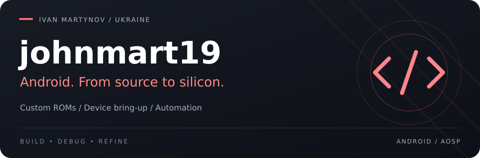
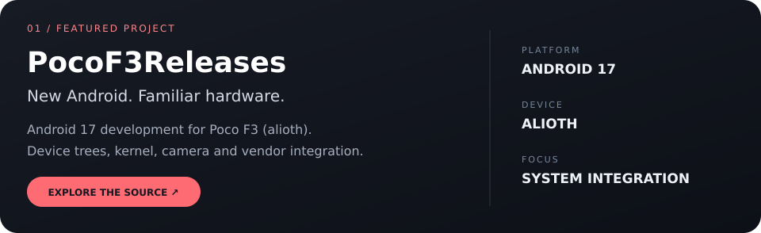
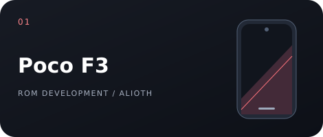
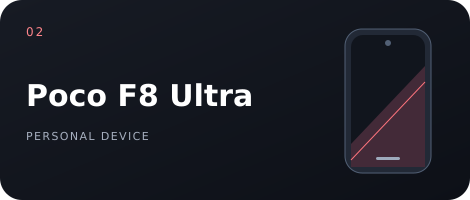

  

  <a href="https://github.com/PocoF3Releases"><b>ANDROID PROJECTS</b></a>
  &nbsp;&nbsp; / &nbsp;&nbsp;
  <a href="https://github.com/johnmart19?tab=repositories"><b>REPOSITORIES</b></a>
  &nbsp;&nbsp; / &nbsp;&nbsp;
  <a href="https://t.me/johnmart19"><b>TELEGRAM</b></a>

 

I build Android ROMs and work on the details that make the hardware usable: camera pipelines, audio, kernel configuration and vendor integration. Python and Shell help me automate the repetitive parts.

 

 
 

### My devices

  
  

### Under the hood

**Android / AOSP** &nbsp; · &nbsp; **Java** &nbsp; · &nbsp; **Kotlin** &nbsp; · &nbsp; **Python** &nbsp; · &nbsp; **Shell** &nbsp; · &nbsp; **Git**

Ubuntu + WSL on Windows. From build scripts to on-device debugging.

<strong>Workstation & hardware</strong>

 

| Component | Setup |
| :--- | :--- |
| CPU | AMD Ryzen 7 5800X3D |
| Cooling | be quiet! Dark Rock Pro 4 |
| Memory | 128 GB DDR4 · 3600 MHz |
| Graphics | Sapphire NITRO+ Radeon RX 7900 XTX Vapor-X · 24 GB |
| Storage | Samsung 990 Pro 2 TB + Samsung 990 Evo Plus 1 TB |
| Power supply | MSI MAG A1000GL PCIE5 · 1000 W |
| Displays | 1440p + 1080p |

